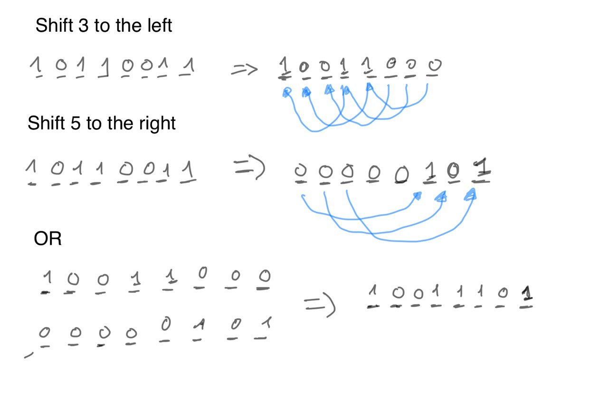

# Simple Encryptor

https://app.hackthebox.com/challenges/Simple%2520Encryptor

On our regular checkups of our secret flag storage server we found out that we were hit by ransomware! The original flag data is nowhere to be found, but luckily we not only have the encrypted file but also the encryption program itself.

We are given a binary file called `encrypt` and the file `flag.enc`

We need to reverse the binary, the main function expects the file `flag` to be present, if it is it encrypts it with the algorithm and generate the `flag.enc` file.

The first 4 bytes in the file and the 32-bit truncated system-time used for the encryption
The next content in the content of `flag` file shifted somehow:

```shell
-rw-rw-r-- 1 gal gal    11 Aug 16 15:10 flag
-rw-rw-r-- 1 gal gal    15 Aug 16 15:10 flag.enc
```

Whatever content you write in `flag`, `flag.enc` is the same size plus 4 bytes (32-bit truncated unix time)

The next content is encrypted doing some bitwise operations:
1) Computes a random integer, take the lowest 8 bits and do XOR with the byte at position i
2) Computes another random integer restricted from 0 to 7.
3) Perform left bitwise shift by the number determined by the random number. This is not standard bitwise shirt, in the standard operation the excess bit are lost, however here there are pushed through the start of the binaries. In order to so, first perform the standard bit shift and then perform the right bitwise shit of the excess bits (8-random number) and finally perform the bitwise OR of the two shifted values.

It's easy to visualize in an example:



In order to revert the encryption, first we need to be able to generate exactly the same sequence of random number. Since computers use pseudo-random number generators (`PRNG`) and we have the seed, we can generate exactly the same sequence of random number. But, there's one caveat: `python` and `c` uses different `PRNG` implementations.

Having said that, the first starting point is trying to write our own encryption program in python and make sure another file is generated with exactly the same content:

```bash
└─$ python reencrypt.py # generates flag.reenc from python implementation
└─$ md5sum flag.enc flag.reenc 
4c5c95630c496b16c9977521647d5d6a  flag.enc
4c5c95630c496b16c9977521647d5d6a  flag.reenc
```

The key to do this was to used `ctypes` library to actually call `libc` `srand()` and `rand()` functions to generate the same sequence of random numbers.

Once we have the encryption mechanism written in python, we can write the decryption mechanism. Just remember to invert the order of the algorithm:
1) Request the random number for the XOR
2) Request the random number for the bit shifting
3) Revert the bit shifting: what was shifted left, now is shifted right and vice versa
4) Revert the XOR

And voilà, you will get the flag!